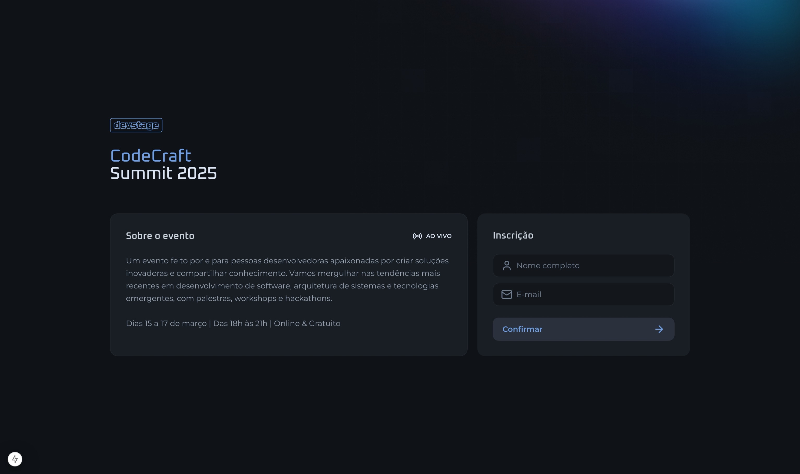
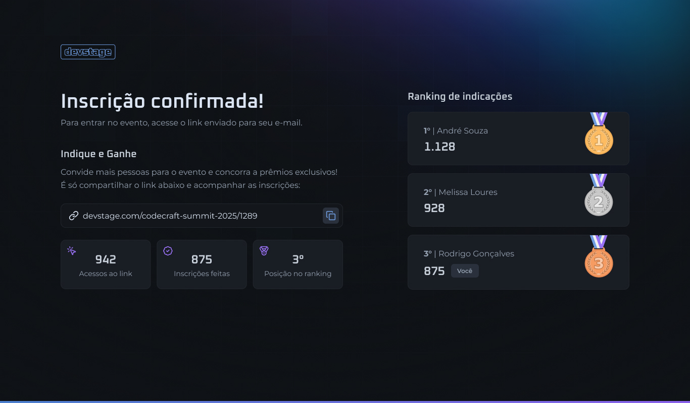

# Devstage

Devstage is a web application built with Next.js, React, and TypeScript. It's an event registration platform that allows users to subscribe to events and track their invite links.

## Screenshots




## Features

- Event registration with email and name validation
- Invite link generation and tracking
- Ranking system for subscribers
- Statistics display for subscribers


## Tech Stack

Next.js, React, TypeScript, Tailwind CSS, Lucide React (icon library)
## Documentation

The API client is generated using Orval and is located in `src/http/api.ts`. It provides functions for interacting with the backend API, including:

`subscribeToEvent`: Subscribe to an event with email and name

`getRanking`: Retrieve the ranking for a subscriber

`getSubscriberInviteClicks`: Retrieve the number of invite clicks for a subscriber

`getSubscriberInviteCount`: Retrieve the number of invites for a subscriber

`getSubscriberRankingPosition`: Retrieve the ranking position for a subscriber
## Installation

Install my-project with npm/pnpm

Install:
```bash
  cd my-project
  pnpm install my-project
```

Run:
```bash
  pnpm dev
```

Build:
```bash
  pnpm build
```

Start build:
```bash
  pnpm start
```
## Support

I hope this helps! Let me know if you need any further assistance.
